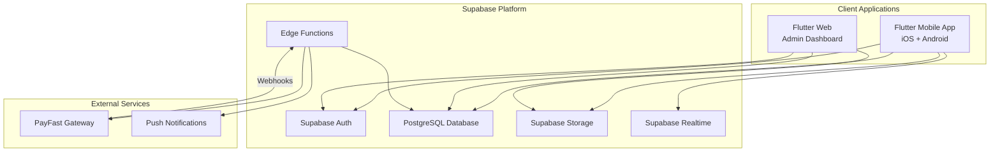
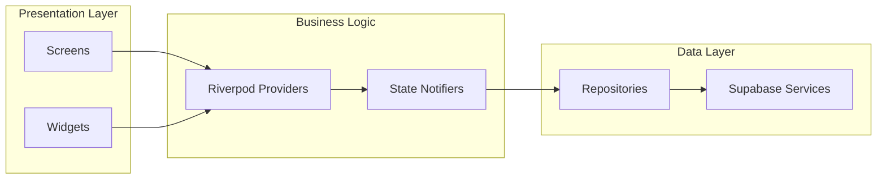
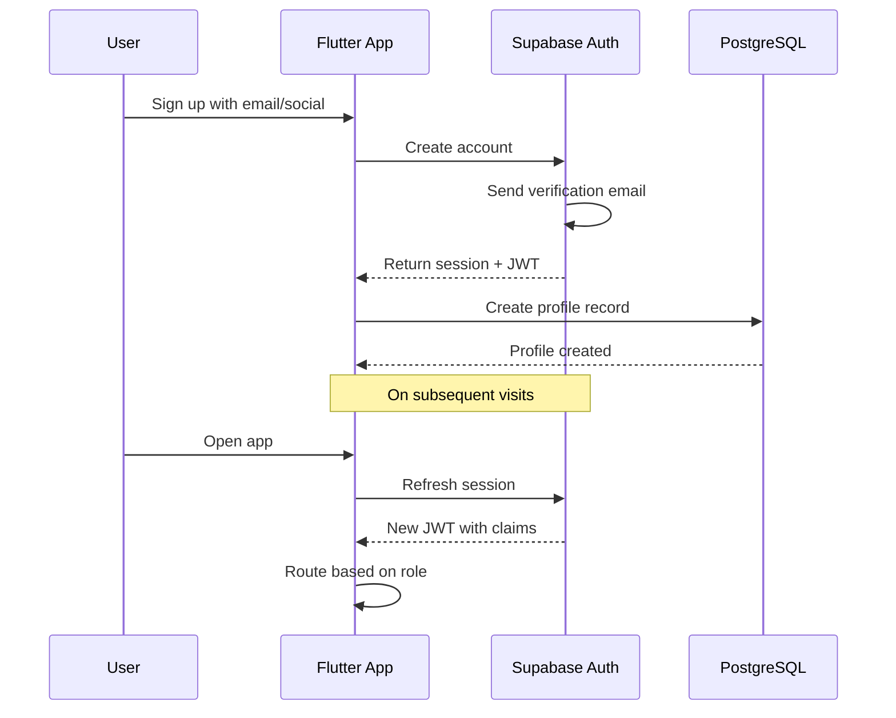
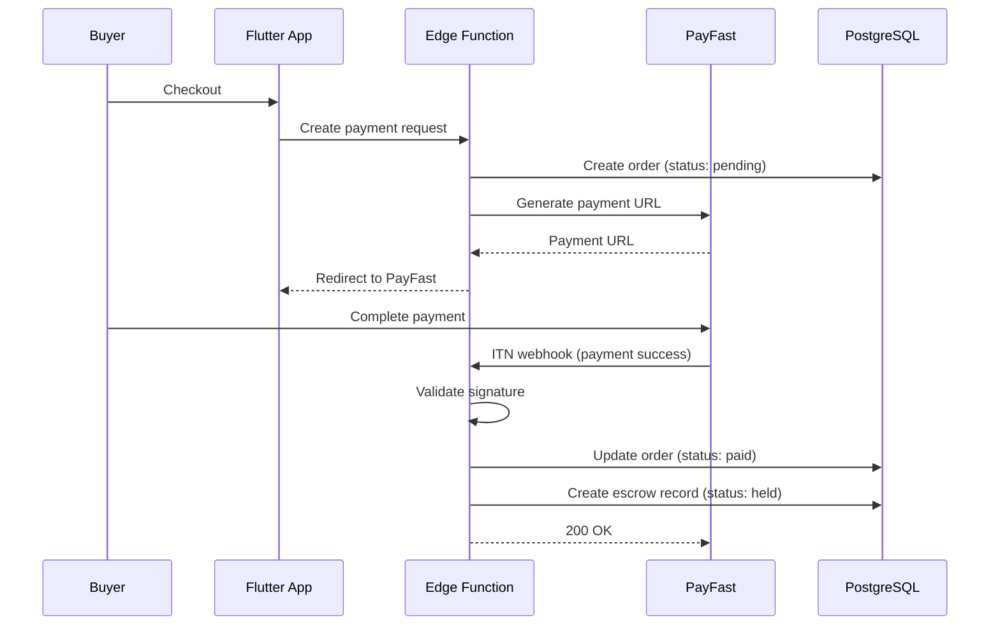
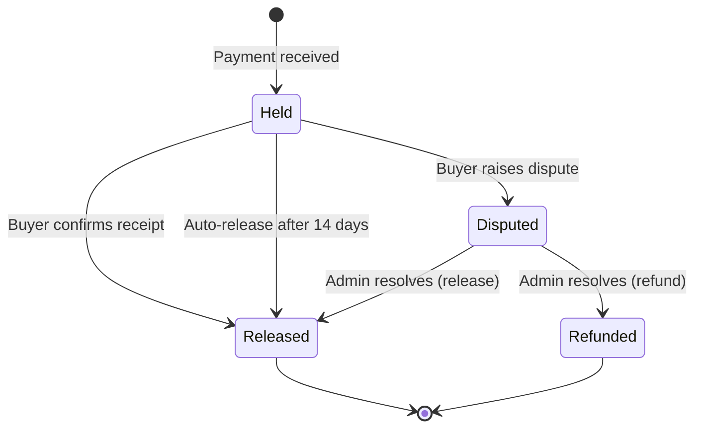

# Technical Architecture

**Project:** Artisanal Lane -- Curated Craft Marketplace
**Version:** 1.0

---

## Table of Contents

1. [High-Level Architecture](#1-high-level-architecture)
2. [System Components](#2-system-components)
3. [Authentication Strategy](#3-authentication-strategy)
4. [Data Layer](#4-data-layer)
5. [Storage Architecture](#5-storage-architecture)
6. [Payment Integration](#6-payment-integration)
7. [Edge Functions](#7-edge-functions)
8. [Real-Time Features](#8-real-time-features)
9. [Security](#9-security)
10. [Scalability Considerations](#10-scalability-considerations)

---

## 1. High-Level Architecture



### Component Overview

| Component          | Technology       | Purpose                                           |
| ------------------ | ---------------- | ------------------------------------------------- |
| Mobile App         | Flutter 3.x      | Cross-platform buyer and vendor experience         |
| Admin Dashboard    | Flutter Web      | Platform management and moderation                 |
| Authentication     | Supabase Auth    | User registration, login, social OAuth, RBAC       |
| Database           | PostgreSQL 15+   | Transactional data, RLS-enforced access            |
| Object Storage     | Supabase Storage | Product images, shop branding, avatars             |
| Serverless Logic   | Edge Functions   | Webhooks, escrow logic, invite codes               |
| Payment Gateway    | PayFast          | Payment processing and escrow                      |
| Real-Time          | Supabase Realtime| Live order status updates                          |

---

## 2. System Components

### 2.1 Flutter Mobile Application

The mobile app is the primary interface for both Buyers and Vendors.

**Architecture Pattern:** Feature-first with clean separation of concerns.



**Key Decisions:**
- **State Management:** Riverpod for dependency injection, caching, and reactive state.
- **Routing:** GoRouter for declarative, role-based navigation.
- **HTTP Client:** Supabase Flutter SDK (wraps PostgREST and GoTrue).
- **Image Handling:** `cached_network_image` for efficient image loading and caching.

### 2.2 Admin Dashboard (Flutter Web)

A separate Flutter Web build sharing models and services with the mobile app. This reduces code duplication and ensures data consistency.

**Deployment:** Static site hosted on Vercel or Netlify, communicating directly with Supabase.

### 2.3 Supabase Backend

Supabase acts as the complete backend-as-a-service:

| Service          | Usage                                                          |
| ---------------- | -------------------------------------------------------------- |
| Auth             | Email/password, Google OAuth, Apple Sign-In                    |
| Database         | PostgreSQL with RLS for multi-tenant data isolation            |
| Storage          | Image buckets with public read, authenticated write            |
| Edge Functions   | Deno-based serverless functions for webhooks and business logic |
| Realtime         | WebSocket subscriptions for order status changes               |

---

## 3. Authentication Strategy

### 3.1 Auth Flow



### 3.2 Role-Based Access Control (RBAC)

Roles are stored in the `profiles` table and embedded in the JWT via a Supabase hook:

| Role   | Access Level                                              |
| ------ | --------------------------------------------------------- |
| buyer  | Browse marketplace, manage cart, place orders, favourites |
| vendor | All buyer access + shop management, product CRUD, orders  |
| admin  | Full platform access via admin dashboard                  |

**Implementation:**
- A `profiles.role` column stores the user's role (`buyer`, `vendor`, `admin`).
- A PostgreSQL function `get_user_role()` retrieves the role from the current JWT.
- RLS policies reference this function to enforce row-level access.

### 3.3 Social Login Providers

| Provider | Platform | Configuration                         |
| -------- | -------- | ------------------------------------- |
| Google   | Both     | OAuth 2.0 via Supabase Auth           |
| Apple    | iOS      | Sign in with Apple (required by Apple)|

---

## 4. Data Layer

### 4.1 Database Design Principles

- **Normalization:** Tables are normalized to 3NF to minimize redundancy.
- **UUIDs:** All primary keys use `uuid` type (generated by `gen_random_uuid()`).
- **Timestamps:** All tables include `created_at` (default `now()`) and relevant `updated_at` columns.
- **Soft Deletes:** Products and shops use `is_active` / `is_published` flags rather than hard deletes.
- **JSONB:** Product images stored as JSONB arrays for flexible multi-image support.

### 4.2 Data Access Pattern

```
Flutter App
  -> Supabase Client SDK
    -> PostgREST API (auto-generated from schema)
      -> PostgreSQL (RLS enforced)
```

All data access goes through PostgREST. No custom API layer is needed for standard CRUD operations. Complex operations (payment processing, escrow state changes) use Edge Functions.

### 4.3 Caching Strategy

| Layer          | Strategy                                                  |
| -------------- | --------------------------------------------------------- |
| Client         | Riverpod caching with TTL for product lists and shop data |
| Images         | `cached_network_image` with disk cache                    |
| Database       | Supabase connection pooling via PgBouncer                 |

---

## 5. Storage Architecture

### 5.1 Bucket Structure

| Bucket           | Access          | Purpose                                  | Max File Size |
| ---------------- | --------------- | ---------------------------------------- | ------------- |
| `product-images` | Public read     | Product photos uploaded by vendors        | 5 MB          |
| `shop-assets`    | Public read     | Shop logos and cover images               | 5 MB          |
| `avatars`        | Public read     | User profile pictures                    | 2 MB          |

### 5.2 Image Processing

- **Upload:** Client-side compression before upload (max 1920px width, JPEG quality 80%).
- **Delivery:** Supabase Storage serves images via CDN with automatic caching.
- **Naming:** Files stored with path pattern: `{bucket}/{user_id}/{timestamp}_{filename}`.

### 5.3 Storage RLS Policies

- **Read:** Public for all buckets (product images must be publicly viewable).
- **Write:** Authenticated users can upload to their own user ID folder only.
- **Delete:** Users can delete their own uploads; admins can delete any file.

---

## 6. Payment Integration

### 6.1 PayFast Integration Architecture



### 6.2 PayFast Configuration

| Setting            | Value                                          |
| ------------------ | ---------------------------------------------- |
| Integration Type   | Custom integration (server-side)               |
| ITN (webhook) URL  | `https://<project>.supabase.co/functions/v1/payfast-itn` |
| Return URL         | Deep link back to app order confirmation        |
| Cancel URL         | Deep link back to app cart                      |
| Sandbox            | Used during development and testing             |

### 6.3 Escrow State Machine



---

## 7. Edge Functions

Supabase Edge Functions (Deno runtime) handle server-side logic that cannot be expressed as RLS policies or client-side operations.

| Function              | Trigger          | Purpose                                          |
| --------------------- | ---------------- | ------------------------------------------------ |
| `payfast-itn`         | PayFast webhook  | Validate payment notification, update order/escrow|
| `create-checkout`     | App request      | Generate PayFast payment URL with order details   |
| `release-escrow`      | App/cron         | Release funds to vendor after confirmation/timeout|
| `generate-invite`     | Admin request    | Create unique invite codes for vendor onboarding  |
| `process-refund`      | Admin request    | Initiate PayFast refund for disputed orders        |

### Environment Variables

| Variable                | Description                        |
| ----------------------- | ---------------------------------- |
| `PAYFAST_MERCHANT_ID`   | PayFast merchant identifier        |
| `PAYFAST_MERCHANT_KEY`  | PayFast merchant key               |
| `PAYFAST_PASSPHRASE`    | PayFast security passphrase        |
| `PAYFAST_SANDBOX`       | `true` for sandbox, `false` for production |
| `SUPABASE_SERVICE_ROLE_KEY` | Service role key for admin DB operations |

---

## 8. Real-Time Features

### 8.1 Supabase Realtime Subscriptions

| Subscription Target    | Subscriber | Event                              |
| ---------------------- | ---------- | ---------------------------------- |
| `orders` table         | Buyer      | Order status changes (shipped, delivered) |
| `orders` table         | Vendor     | New incoming orders                 |
| `vendor_applications`  | Vendor     | Application approval/rejection      |

### 8.2 Implementation

```dart
// Example: Listen for order status updates
supabase
  .from('orders')
  .stream(primaryKey: ['id'])
  .eq('buyer_id', currentUserId)
  .listen((List<Map<String, dynamic>> data) {
    // Update local state with new order status
  });
```

---

## 9. Security

### 9.1 Row Level Security (RLS)

Every table has RLS enabled. Policies follow the principle of least privilege:

| Table               | Select                          | Insert               | Update               | Delete        |
| ------------------- | ------------------------------- | -------------------- | -------------------- | ------------- |
| profiles            | Own profile or public fields    | Own profile           | Own profile           | None          |
| shops               | All (public)                    | Own (vendor)          | Own (vendor)          | None          |
| products            | Published only (public)         | Own shop (vendor)     | Own shop (vendor)     | None          |
| orders              | Own orders (buyer/vendor)       | System (edge fn)      | System (edge fn)      | None          |
| escrow_transactions | Own (buyer/vendor) + admin      | System (edge fn)      | System (edge fn)      | None          |
| vendor_applications | Own (applicant) + admin         | Authenticated         | Admin only            | None          |

### 9.2 API Security

- **Anon Key:** Used by the Flutter client; limited by RLS policies.
- **Service Role Key:** Used only in Edge Functions; bypasses RLS for admin operations.
- **JWT Verification:** All Edge Function webhooks verify the PayFast signature before processing.
- **Rate Limiting:** Supabase built-in rate limiting on auth endpoints.

### 9.3 Client Security

- No secrets stored in the Flutter app bundle.
- Supabase anon key is safe to include in client (protected by RLS).
- Payment tokens handled exclusively server-side (Edge Functions).
- SSL certificate pinning recommended for production.

---

## 10. Scalability Considerations

### 10.1 Database

- **Connection Pooling:** PgBouncer enabled by default in Supabase.
- **Indexes:** Composite indexes on frequently queried columns (see Database Schema doc).
- **Pagination:** All list endpoints use cursor-based or offset pagination.
- **Archival:** Old completed orders can be archived to reduce active table size.

### 10.2 Storage

- **CDN:** Supabase Storage uses a global CDN for image delivery.
- **Optimization:** Client-side image compression before upload reduces storage costs.
- **Cleanup:** Orphaned images (from deleted products) cleaned via scheduled Edge Function.

### 10.3 Compute

- **Edge Functions:** Auto-scale with request volume; no server management needed.
- **Cold Starts:** Edge Functions have minimal cold start times (~50ms) due to Deno runtime.

### 10.4 Cost Projections (Supabase Free Tier Limits)

| Resource           | Free Tier Limit      | Scaling Plan                    |
| ------------------ | -------------------- | ------------------------------- |
| Database           | 500 MB               | Pro plan at 8 GB ($25/month)    |
| Storage            | 1 GB                 | Pro plan at 100 GB ($25/month)  |
| Edge Functions     | 500K invocations     | Pro plan at 2M ($25/month)      |
| Auth               | 50K MAU              | Sufficient for initial launch   |
| Realtime           | 200 concurrent       | Pro plan at 500 ($25/month)     |

> **Recommendation:** Start on the Supabase Free tier during development. Upgrade to Pro ($25/month) before launch to ensure adequate resources.
