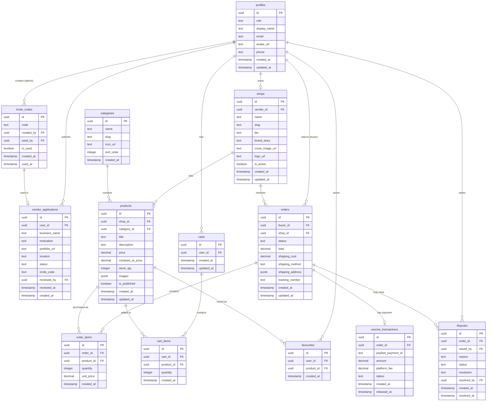

# Database Schema

**Project:** Artisanal Lane -- Curated Craft Marketplace
**Database:** PostgreSQL 15+ (via Supabase)
**Version:** 1.0

---

## Table of Contents

1. [Entity-Relationship Diagram](#1-entity-relationship-diagram)
2. [Table Definitions](#2-table-definitions)
3. [Row Level Security Policies](#3-row-level-security-policies)
4. [Indexes](#4-indexes)
5. [Database Functions](#5-database-functions)
6. [Triggers](#6-triggers)
7. [Seed Data](#7-seed-data)

---

## 1. Entity-Relationship Diagram



---

## 2. Table Definitions

### 2.1 profiles

Extends Supabase `auth.users`. Created automatically via a trigger when a new user signs up.

```sql
CREATE TABLE public.profiles (
    id          UUID PRIMARY KEY REFERENCES auth.users(id) ON DELETE CASCADE,
    role        TEXT NOT NULL DEFAULT 'buyer' CHECK (role IN ('buyer', 'vendor', 'admin')),
    display_name TEXT,
    email       TEXT,
    avatar_url  TEXT,
    phone       TEXT,
    created_at  TIMESTAMPTZ NOT NULL DEFAULT now(),
    updated_at  TIMESTAMPTZ NOT NULL DEFAULT now()
);
```

### 2.2 vendor_applications

Tracks vendor applications through the approval workflow.

```sql
CREATE TABLE public.vendor_applications (
    id            UUID PRIMARY KEY DEFAULT gen_random_uuid(),
    user_id       UUID NOT NULL REFERENCES public.profiles(id) ON DELETE CASCADE,
    business_name TEXT NOT NULL,
    motivation    TEXT NOT NULL,
    portfolio_url TEXT,
    location      TEXT,
    status        TEXT NOT NULL DEFAULT 'pending' CHECK (status IN ('pending', 'approved', 'rejected')),
    invite_code   TEXT NOT NULL,
    reviewed_by   UUID REFERENCES public.profiles(id),
    reviewed_at   TIMESTAMPTZ,
    created_at    TIMESTAMPTZ NOT NULL DEFAULT now(),

    CONSTRAINT unique_user_application UNIQUE (user_id)
);
```

### 2.3 shops

Vendor shop profiles with branding information.

```sql
CREATE TABLE public.shops (
    id              UUID PRIMARY KEY DEFAULT gen_random_uuid(),
    vendor_id       UUID NOT NULL UNIQUE REFERENCES public.profiles(id) ON DELETE CASCADE,
    name            TEXT NOT NULL,
    slug            TEXT NOT NULL UNIQUE,
    bio             TEXT,
    brand_story     TEXT,
    cover_image_url TEXT,
    logo_url        TEXT,
    is_active       BOOLEAN NOT NULL DEFAULT true,
    created_at      TIMESTAMPTZ NOT NULL DEFAULT now(),
    updated_at      TIMESTAMPTZ NOT NULL DEFAULT now()
);
```

### 2.4 categories

Product categories managed by admins.

```sql
CREATE TABLE public.categories (
    id         UUID PRIMARY KEY DEFAULT gen_random_uuid(),
    name       TEXT NOT NULL UNIQUE,
    slug       TEXT NOT NULL UNIQUE,
    icon_url   TEXT,
    sort_order INTEGER NOT NULL DEFAULT 0,
    created_at TIMESTAMPTZ NOT NULL DEFAULT now()
);
```

### 2.5 products

Products listed by vendors in their shops.

```sql
CREATE TABLE public.products (
    id               UUID PRIMARY KEY DEFAULT gen_random_uuid(),
    shop_id          UUID NOT NULL REFERENCES public.shops(id) ON DELETE CASCADE,
    category_id      UUID REFERENCES public.categories(id) ON DELETE SET NULL,
    title            TEXT NOT NULL,
    description      TEXT,
    price            DECIMAL(10,2) NOT NULL CHECK (price >= 0),
    compare_at_price DECIMAL(10,2) CHECK (compare_at_price IS NULL OR compare_at_price >= 0),
    stock_qty        INTEGER NOT NULL DEFAULT 0 CHECK (stock_qty >= 0),
    images           JSONB NOT NULL DEFAULT '[]'::jsonb,
    is_published     BOOLEAN NOT NULL DEFAULT false,
    created_at       TIMESTAMPTZ NOT NULL DEFAULT now(),
    updated_at       TIMESTAMPTZ NOT NULL DEFAULT now()
);
```

### 2.6 favourites

Buyer wishlist / saved products.

```sql
CREATE TABLE public.favourites (
    id         UUID PRIMARY KEY DEFAULT gen_random_uuid(),
    user_id    UUID NOT NULL REFERENCES public.profiles(id) ON DELETE CASCADE,
    product_id UUID NOT NULL REFERENCES public.products(id) ON DELETE CASCADE,
    created_at TIMESTAMPTZ NOT NULL DEFAULT now(),

    CONSTRAINT unique_favourite UNIQUE (user_id, product_id)
);
```

### 2.7 carts

Shopping carts, one per user.

```sql
CREATE TABLE public.carts (
    id         UUID PRIMARY KEY DEFAULT gen_random_uuid(),
    user_id    UUID NOT NULL UNIQUE REFERENCES public.profiles(id) ON DELETE CASCADE,
    created_at TIMESTAMPTZ NOT NULL DEFAULT now(),
    updated_at TIMESTAMPTZ NOT NULL DEFAULT now()
);
```

### 2.8 cart_items

Individual items within a cart.

```sql
CREATE TABLE public.cart_items (
    id         UUID PRIMARY KEY DEFAULT gen_random_uuid(),
    cart_id    UUID NOT NULL REFERENCES public.carts(id) ON DELETE CASCADE,
    product_id UUID NOT NULL REFERENCES public.products(id) ON DELETE CASCADE,
    quantity   INTEGER NOT NULL DEFAULT 1 CHECK (quantity > 0),
    created_at TIMESTAMPTZ NOT NULL DEFAULT now(),

    CONSTRAINT unique_cart_product UNIQUE (cart_id, product_id)
);
```

### 2.9 orders

Order records created at checkout.

```sql
CREATE TABLE public.orders (
    id               UUID PRIMARY KEY DEFAULT gen_random_uuid(),
    buyer_id         UUID NOT NULL REFERENCES public.profiles(id),
    shop_id          UUID NOT NULL REFERENCES public.shops(id),
    status           TEXT NOT NULL DEFAULT 'pending'
                     CHECK (status IN ('pending', 'paid', 'shipped', 'delivered', 'disputed', 'refunded', 'cancelled')),
    total            DECIMAL(10,2) NOT NULL CHECK (total >= 0),
    shipping_cost    DECIMAL(10,2) NOT NULL DEFAULT 0 CHECK (shipping_cost >= 0),
    shipping_method  TEXT NOT NULL,
    shipping_address JSONB,
    tracking_number  TEXT,
    created_at       TIMESTAMPTZ NOT NULL DEFAULT now(),
    updated_at       TIMESTAMPTZ NOT NULL DEFAULT now()
);
```

### 2.10 order_items

Line items within an order.

```sql
CREATE TABLE public.order_items (
    id         UUID PRIMARY KEY DEFAULT gen_random_uuid(),
    order_id   UUID NOT NULL REFERENCES public.orders(id) ON DELETE CASCADE,
    product_id UUID NOT NULL REFERENCES public.products(id),
    quantity   INTEGER NOT NULL CHECK (quantity > 0),
    unit_price DECIMAL(10,2) NOT NULL CHECK (unit_price >= 0),
    created_at TIMESTAMPTZ NOT NULL DEFAULT now()
);
```

### 2.11 escrow_transactions

Tracks payment escrow lifecycle per order.

```sql
CREATE TABLE public.escrow_transactions (
    id                 UUID PRIMARY KEY DEFAULT gen_random_uuid(),
    order_id           UUID NOT NULL UNIQUE REFERENCES public.orders(id),
    payfast_payment_id TEXT,
    amount             DECIMAL(10,2) NOT NULL CHECK (amount >= 0),
    platform_fee       DECIMAL(10,2) NOT NULL DEFAULT 0 CHECK (platform_fee >= 0),
    status             TEXT NOT NULL DEFAULT 'held'
                       CHECK (status IN ('held', 'released', 'refunded')),
    created_at         TIMESTAMPTZ NOT NULL DEFAULT now(),
    released_at        TIMESTAMPTZ
);
```

### 2.12 disputes

Order dispute records.

```sql
CREATE TABLE public.disputes (
    id          UUID PRIMARY KEY DEFAULT gen_random_uuid(),
    order_id    UUID NOT NULL REFERENCES public.orders(id),
    raised_by   UUID NOT NULL REFERENCES public.profiles(id),
    reason      TEXT NOT NULL,
    status      TEXT NOT NULL DEFAULT 'open' CHECK (status IN ('open', 'resolved')),
    resolution  TEXT,
    resolved_by UUID REFERENCES public.profiles(id),
    created_at  TIMESTAMPTZ NOT NULL DEFAULT now(),
    resolved_at TIMESTAMPTZ
);
```

### 2.13 invite_codes

Invite codes generated by admins for vendor onboarding.

```sql
CREATE TABLE public.invite_codes (
    id         UUID PRIMARY KEY DEFAULT gen_random_uuid(),
    code       TEXT NOT NULL UNIQUE,
    created_by UUID NOT NULL REFERENCES public.profiles(id),
    used_by    UUID REFERENCES public.profiles(id),
    is_used    BOOLEAN NOT NULL DEFAULT false,
    created_at TIMESTAMPTZ NOT NULL DEFAULT now(),
    used_at    TIMESTAMPTZ
);
```

---

## 3. Row Level Security Policies

All tables have RLS enabled. Below are the policy definitions.

### 3.1 profiles

```sql
ALTER TABLE public.profiles ENABLE ROW LEVEL SECURITY;

-- Anyone can read public profile fields
CREATE POLICY "Public profiles are viewable by everyone"
    ON public.profiles FOR SELECT
    USING (true);

-- Users can update their own profile
CREATE POLICY "Users can update own profile"
    ON public.profiles FOR UPDATE
    USING (auth.uid() = id)
    WITH CHECK (auth.uid() = id);

-- Profile is created via trigger (insert by service role)
CREATE POLICY "Service role can insert profiles"
    ON public.profiles FOR INSERT
    WITH CHECK (auth.uid() = id);
```

### 3.2 vendor_applications

```sql
ALTER TABLE public.vendor_applications ENABLE ROW LEVEL SECURITY;

-- Users can view their own application
CREATE POLICY "Users can view own application"
    ON public.vendor_applications FOR SELECT
    USING (auth.uid() = user_id OR public.get_user_role() = 'admin');

-- Authenticated users can submit an application
CREATE POLICY "Authenticated users can apply"
    ON public.vendor_applications FOR INSERT
    WITH CHECK (auth.uid() = user_id);

-- Only admins can update applications (approve/reject)
CREATE POLICY "Admins can update applications"
    ON public.vendor_applications FOR UPDATE
    USING (public.get_user_role() = 'admin');
```

### 3.3 shops

```sql
ALTER TABLE public.shops ENABLE ROW LEVEL SECURITY;

-- Active shops are viewable by everyone
CREATE POLICY "Active shops are public"
    ON public.shops FOR SELECT
    USING (is_active = true OR auth.uid() = vendor_id OR public.get_user_role() = 'admin');

-- Vendors can update their own shop
CREATE POLICY "Vendors can update own shop"
    ON public.shops FOR UPDATE
    USING (auth.uid() = vendor_id)
    WITH CHECK (auth.uid() = vendor_id);

-- Shop creation via service role on approval
CREATE POLICY "Service role creates shops"
    ON public.shops FOR INSERT
    WITH CHECK (auth.uid() = vendor_id);
```

### 3.4 products

```sql
ALTER TABLE public.products ENABLE ROW LEVEL SECURITY;

-- Published products are public; vendors see their own; admins see all
CREATE POLICY "Published products are public"
    ON public.products FOR SELECT
    USING (
        is_published = true
        OR shop_id IN (SELECT id FROM public.shops WHERE vendor_id = auth.uid())
        OR public.get_user_role() = 'admin'
    );

-- Vendors can insert products in their own shop
CREATE POLICY "Vendors can create products"
    ON public.products FOR INSERT
    WITH CHECK (shop_id IN (SELECT id FROM public.shops WHERE vendor_id = auth.uid()));

-- Vendors can update their own products; admins can update any
CREATE POLICY "Vendors can update own products"
    ON public.products FOR UPDATE
    USING (
        shop_id IN (SELECT id FROM public.shops WHERE vendor_id = auth.uid())
        OR public.get_user_role() = 'admin'
    );
```

### 3.5 favourites

```sql
ALTER TABLE public.favourites ENABLE ROW LEVEL SECURITY;

CREATE POLICY "Users manage own favourites"
    ON public.favourites FOR ALL
    USING (auth.uid() = user_id)
    WITH CHECK (auth.uid() = user_id);
```

### 3.6 carts and cart_items

```sql
ALTER TABLE public.carts ENABLE ROW LEVEL SECURITY;
ALTER TABLE public.cart_items ENABLE ROW LEVEL SECURITY;

CREATE POLICY "Users manage own cart"
    ON public.carts FOR ALL
    USING (auth.uid() = user_id)
    WITH CHECK (auth.uid() = user_id);

CREATE POLICY "Users manage own cart items"
    ON public.cart_items FOR ALL
    USING (cart_id IN (SELECT id FROM public.carts WHERE user_id = auth.uid()))
    WITH CHECK (cart_id IN (SELECT id FROM public.carts WHERE user_id = auth.uid()));
```

### 3.7 orders and order_items

```sql
ALTER TABLE public.orders ENABLE ROW LEVEL SECURITY;
ALTER TABLE public.order_items ENABLE ROW LEVEL SECURITY;

-- Buyers see their own orders; vendors see orders for their shop; admins see all
CREATE POLICY "Order visibility"
    ON public.orders FOR SELECT
    USING (
        auth.uid() = buyer_id
        OR shop_id IN (SELECT id FROM public.shops WHERE vendor_id = auth.uid())
        OR public.get_user_role() = 'admin'
    );

-- Orders are created by Edge Functions (service role)
-- Vendors can update (mark shipped, add tracking)
CREATE POLICY "Vendors can update order shipping"
    ON public.orders FOR UPDATE
    USING (shop_id IN (SELECT id FROM public.shops WHERE vendor_id = auth.uid()));

CREATE POLICY "Order items visible with order"
    ON public.order_items FOR SELECT
    USING (
        order_id IN (
            SELECT id FROM public.orders
            WHERE buyer_id = auth.uid()
            OR shop_id IN (SELECT id FROM public.shops WHERE vendor_id = auth.uid())
            OR public.get_user_role() = 'admin'
        )
    );
```

### 3.8 escrow_transactions

```sql
ALTER TABLE public.escrow_transactions ENABLE ROW LEVEL SECURITY;

CREATE POLICY "Escrow visibility"
    ON public.escrow_transactions FOR SELECT
    USING (
        order_id IN (
            SELECT id FROM public.orders
            WHERE buyer_id = auth.uid()
            OR shop_id IN (SELECT id FROM public.shops WHERE vendor_id = auth.uid())
        )
        OR public.get_user_role() = 'admin'
    );

-- All mutations via service role (Edge Functions)
```

### 3.9 disputes

```sql
ALTER TABLE public.disputes ENABLE ROW LEVEL SECURITY;

CREATE POLICY "Dispute visibility"
    ON public.disputes FOR SELECT
    USING (auth.uid() = raised_by OR public.get_user_role() = 'admin');

CREATE POLICY "Users can raise disputes"
    ON public.disputes FOR INSERT
    WITH CHECK (auth.uid() = raised_by);

CREATE POLICY "Admins can resolve disputes"
    ON public.disputes FOR UPDATE
    USING (public.get_user_role() = 'admin');
```

### 3.10 invite_codes

```sql
ALTER TABLE public.invite_codes ENABLE ROW LEVEL SECURITY;

-- Admins can view all codes
CREATE POLICY "Admins manage invite codes"
    ON public.invite_codes FOR ALL
    USING (public.get_user_role() = 'admin');

-- Anyone can validate an invite code (read-only by code)
CREATE POLICY "Validate invite code"
    ON public.invite_codes FOR SELECT
    USING (true);
```

---

## 4. Indexes

Performance indexes for frequently queried columns:

```sql
-- Products: browsing and filtering
CREATE INDEX idx_products_shop_id ON public.products(shop_id);
CREATE INDEX idx_products_category_id ON public.products(category_id);
CREATE INDEX idx_products_is_published ON public.products(is_published) WHERE is_published = true;
CREATE INDEX idx_products_price ON public.products(price);
CREATE INDEX idx_products_created_at ON public.products(created_at DESC);
CREATE INDEX idx_products_title_search ON public.products USING gin(to_tsvector('english', title));

-- Shops: slug lookup
CREATE INDEX idx_shops_slug ON public.shops(slug);
CREATE INDEX idx_shops_is_active ON public.shops(is_active) WHERE is_active = true;

-- Orders: buyer and vendor lookups
CREATE INDEX idx_orders_buyer_id ON public.orders(buyer_id);
CREATE INDEX idx_orders_shop_id ON public.orders(shop_id);
CREATE INDEX idx_orders_status ON public.orders(status);
CREATE INDEX idx_orders_created_at ON public.orders(created_at DESC);

-- Favourites: user lookup
CREATE INDEX idx_favourites_user_id ON public.favourites(user_id);

-- Vendor applications: status filtering
CREATE INDEX idx_vendor_applications_status ON public.vendor_applications(status);

-- Invite codes: code lookup
CREATE INDEX idx_invite_codes_code ON public.invite_codes(code);

-- Escrow: order lookup
CREATE INDEX idx_escrow_order_id ON public.escrow_transactions(order_id);

-- Disputes: status filtering
CREATE INDEX idx_disputes_status ON public.disputes(status);
CREATE INDEX idx_disputes_order_id ON public.disputes(order_id);
```

---

## 5. Database Functions

### 5.1 Get User Role

Returns the current authenticated user's role:

```sql
CREATE OR REPLACE FUNCTION public.get_user_role()
RETURNS TEXT
LANGUAGE sql
SECURITY DEFINER
STABLE
AS $$
    SELECT role FROM public.profiles WHERE id = auth.uid();
$$;
```

### 5.2 Handle New User (Auto-create profile)

```sql
CREATE OR REPLACE FUNCTION public.handle_new_user()
RETURNS TRIGGER
LANGUAGE plpgsql
SECURITY DEFINER
AS $$
BEGIN
    INSERT INTO public.profiles (id, email, display_name, role)
    VALUES (
        NEW.id,
        NEW.email,
        COALESCE(NEW.raw_user_meta_data->>'display_name', split_part(NEW.email, '@', 1)),
        'buyer'
    );
    RETURN NEW;
END;
$$;
```

### 5.3 Update Timestamps

```sql
CREATE OR REPLACE FUNCTION public.update_updated_at()
RETURNS TRIGGER
LANGUAGE plpgsql
AS $$
BEGIN
    NEW.updated_at = now();
    RETURN NEW;
END;
$$;
```

### 5.4 Decrement Stock on Order

```sql
CREATE OR REPLACE FUNCTION public.decrement_stock()
RETURNS TRIGGER
LANGUAGE plpgsql
SECURITY DEFINER
AS $$
BEGIN
    UPDATE public.products
    SET stock_qty = stock_qty - NEW.quantity
    WHERE id = NEW.product_id AND stock_qty >= NEW.quantity;

    IF NOT FOUND THEN
        RAISE EXCEPTION 'Insufficient stock for product %', NEW.product_id;
    END IF;

    RETURN NEW;
END;
$$;
```

---

## 6. Triggers

```sql
-- Auto-create profile on user signup
CREATE TRIGGER on_auth_user_created
    AFTER INSERT ON auth.users
    FOR EACH ROW
    EXECUTE FUNCTION public.handle_new_user();

-- Auto-update timestamps
CREATE TRIGGER update_profiles_updated_at
    BEFORE UPDATE ON public.profiles
    FOR EACH ROW
    EXECUTE FUNCTION public.update_updated_at();

CREATE TRIGGER update_shops_updated_at
    BEFORE UPDATE ON public.shops
    FOR EACH ROW
    EXECUTE FUNCTION public.update_updated_at();

CREATE TRIGGER update_products_updated_at
    BEFORE UPDATE ON public.products
    FOR EACH ROW
    EXECUTE FUNCTION public.update_updated_at();

CREATE TRIGGER update_carts_updated_at
    BEFORE UPDATE ON public.carts
    FOR EACH ROW
    EXECUTE FUNCTION public.update_updated_at();

CREATE TRIGGER update_orders_updated_at
    BEFORE UPDATE ON public.orders
    FOR EACH ROW
    EXECUTE FUNCTION public.update_updated_at();

-- Decrement stock when order item is created
CREATE TRIGGER on_order_item_created
    AFTER INSERT ON public.order_items
    FOR EACH ROW
    EXECUTE FUNCTION public.decrement_stock();
```

---

## 7. Seed Data

### 7.1 Default Categories

```sql
INSERT INTO public.categories (name, slug, sort_order) VALUES
    ('Leather Goods',   'leather-goods',   1),
    ('Ceramics',        'ceramics',        2),
    ('Textiles',        'textiles',        3),
    ('Jewellery',       'jewellery',       4),
    ('Woodwork',        'woodwork',        5),
    ('Beadwork',        'beadwork',        6),
    ('Candles & Soap',  'candles-soap',    7),
    ('Art & Prints',    'art-prints',      8),
    ('Home Decor',      'home-decor',      9),
    ('Food & Drink',    'food-drink',     10),
    ('Other',           'other',          99);
```

### 7.2 Default Admin User

After signing up the first admin user through Supabase Auth, promote them:

```sql
UPDATE public.profiles SET role = 'admin' WHERE email = 'admin@artisanallane.co.za';
```
