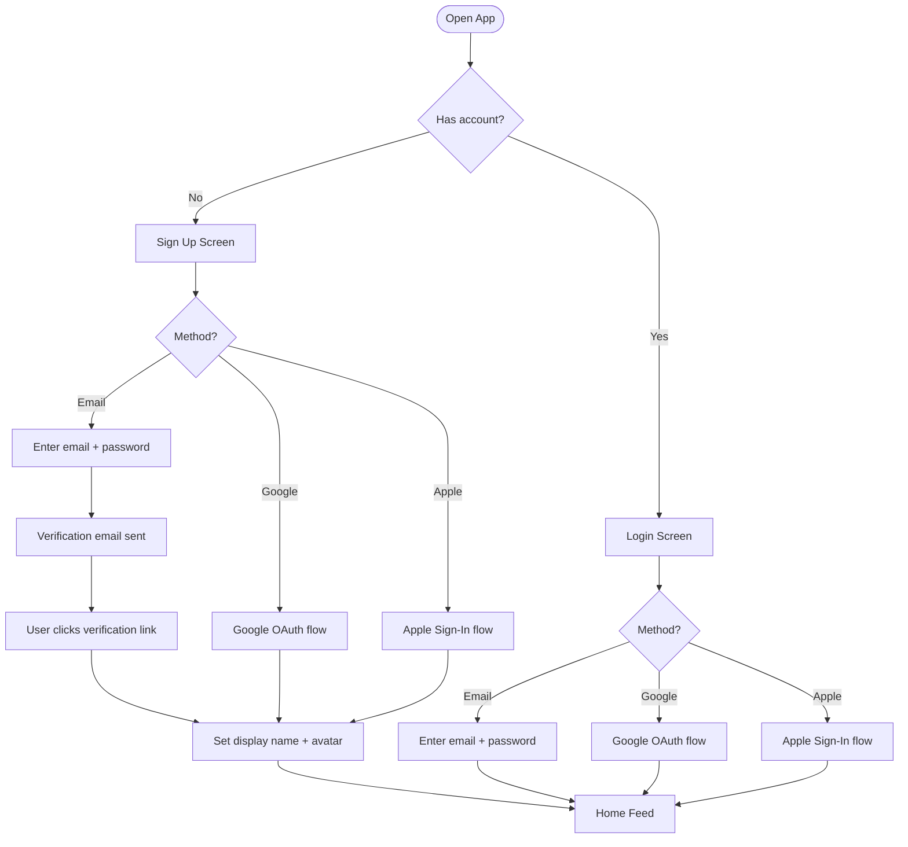
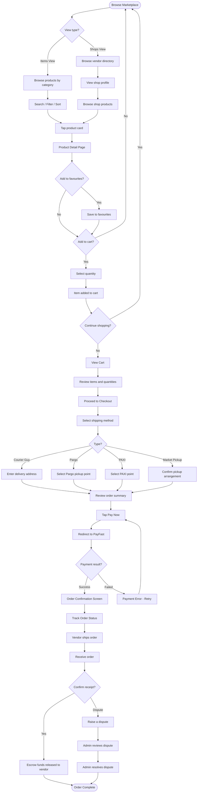
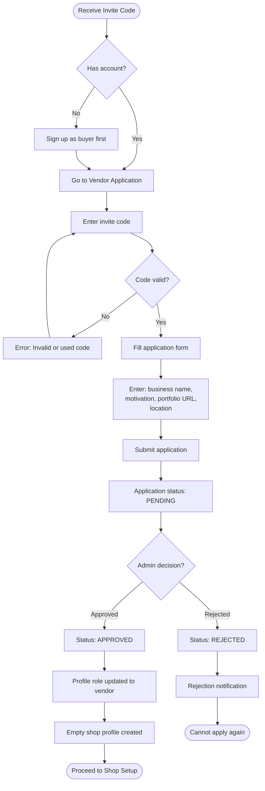
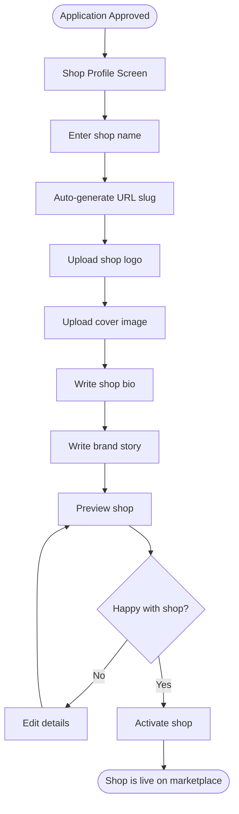
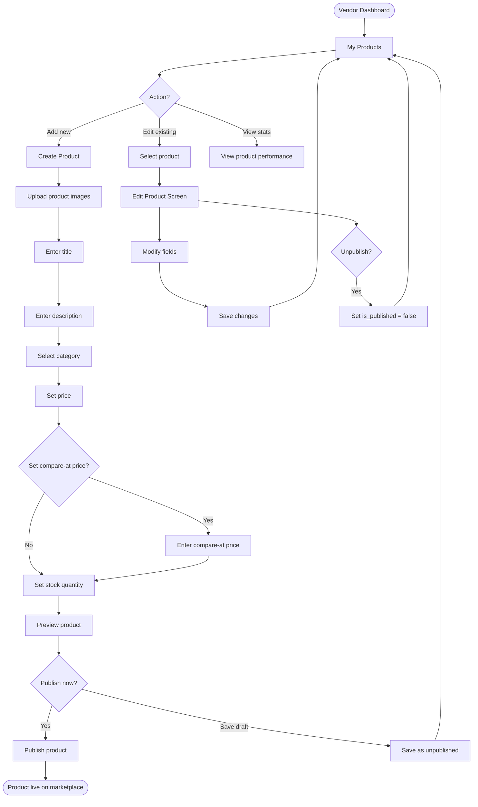
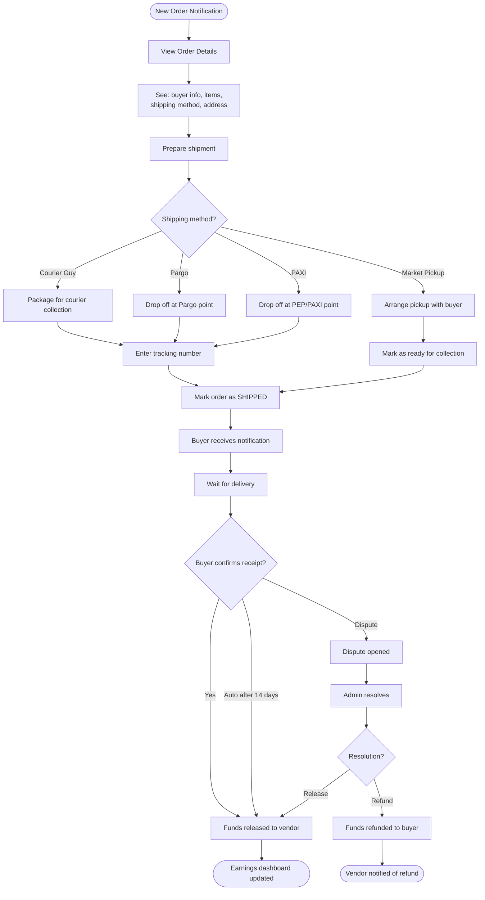
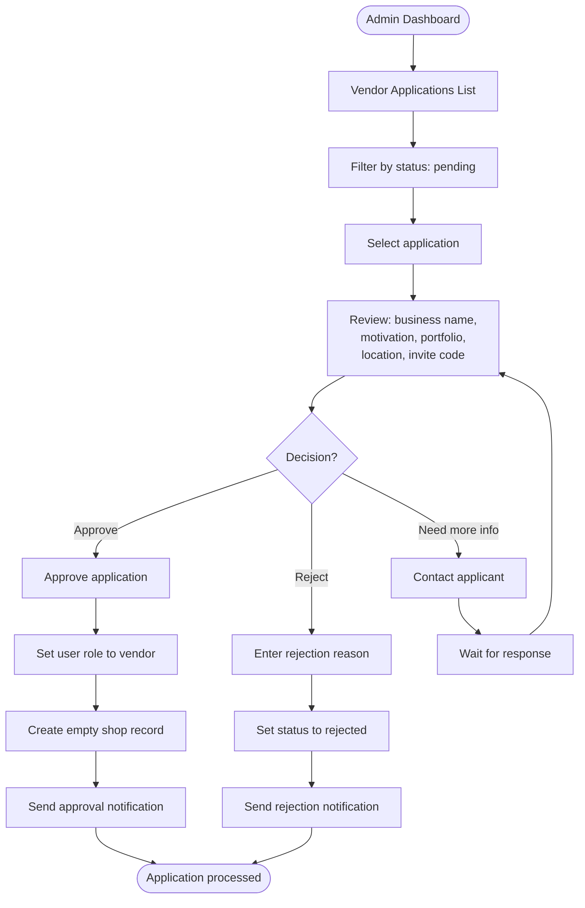
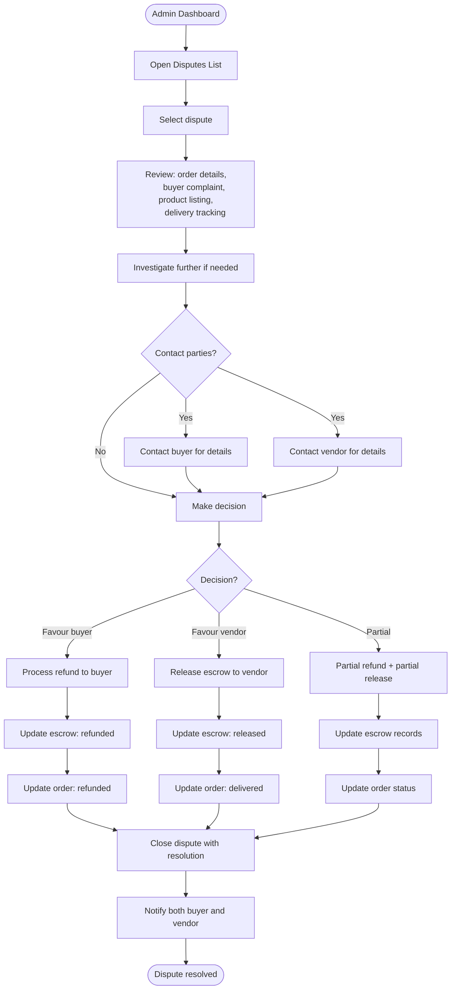

# User Flows

**Project:** Artisanal Lane -- Curated Craft Marketplace
**Version:** 1.0

---

## Table of Contents

1. [Buyer Onboarding](#1-buyer-onboarding)
2. [Buyer Purchase Flow](#2-buyer-purchase-flow)
3. [Vendor Application Flow](#3-vendor-application-flow)
4. [Vendor Shop Setup](#4-vendor-shop-setup)
5. [Vendor Product Management](#5-vendor-product-management)
6. [Vendor Order Fulfillment](#6-vendor-order-fulfillment)
7. [Admin Vendor Approval](#7-admin-vendor-approval)
8. [Admin Dispute Resolution](#8-admin-dispute-resolution)

---

## 1. Buyer Onboarding

### Flow Description

1. User opens the app for the first time and sees the onboarding / welcome screen.
2. User chooses to sign up via email, Google, or Apple.
3. For email sign-up, a verification email is sent; user must verify before full access.
4. After authentication, user sets up their basic profile (display name and optional avatar).
5. User is directed to the home feed and can begin browsing.

---

## 2. Buyer Purchase Flow

### Flow Description

1. Buyer browses the marketplace via the Items view (category-based) or Shops view (vendor-based).
2. Buyer can search, filter by category/price, and sort results.
3. Buyer taps a product to view its detail page (images, description, price, vendor info).
4. Buyer can add the item to favourites or add it to their cart.
5. When ready, buyer views their cart, reviews items, and proceeds to checkout.
6. Buyer selects a shipping method (Courier Guy, Pargo, PAXI, or Market Pickup) and enters any required delivery details.
7. Buyer reviews the order summary and initiates payment via PayFast.
8. On successful payment, an order confirmation is shown with a summary and order number.
9. Buyer can track the order status as it progresses through paid, shipped, and delivered.
10. Upon receiving the item, buyer confirms receipt, which releases escrow funds to the vendor.
11. If there is an issue, buyer can raise a dispute for admin resolution.

---

## 3. Vendor Application Flow

### Flow Description

1. An existing artisan receives an invite code from the Artisanal Lane team or another vendor.
2. They must have an existing buyer account (or sign up for one).
3. In the app, they navigate to "Become a Vendor" and enter their invite code.
4. If the code is valid and unused, they fill out the application form with their business details.
5. The application is submitted and enters a "pending" state.
6. An admin reviews the application and either approves or rejects it.
7. On approval, the user's role is upgraded to "vendor" and an empty shop is created for them.
8. On rejection, the user is notified and the invite code remains consumed.

---

## 4. Vendor Shop Setup

### Flow Description

1. After vendor application approval, the vendor is taken to their shop profile setup.
2. They enter their shop name (URL slug is auto-generated).
3. They upload a logo and cover image for branding.
4. They write a short bio and a longer brand story.
5. They preview how their shop will look to buyers.
6. Once satisfied, they activate the shop and it becomes visible on the marketplace.

---

## 5. Vendor Product Management

### Flow Description

1. From the vendor dashboard, the vendor navigates to "My Products."
2. To add a new product, they upload images, enter title, description, category, pricing, and stock.
3. They can preview the product as buyers will see it.
4. They choose to publish immediately or save as a draft.
5. Existing products can be edited (all fields) or unpublished.
6. Stock quantities are managed manually by the vendor.

---

## 6. Vendor Order Fulfillment

### Flow Description

1. Vendor receives a push notification when a new order is placed for their shop.
2. Vendor views the order details: items, quantities, buyer's selected shipping method, and address.
3. Vendor prepares the shipment according to the selected logistics provider.
4. Vendor enters the tracking number (if applicable) and marks the order as "Shipped."
5. Buyer is notified of shipment.
6. When the buyer confirms receipt (or after 14 days auto-release), escrow funds are released to the vendor.
7. If a dispute is raised, the admin resolves it and funds are either released or refunded.
8. Vendor's earnings dashboard is updated accordingly.

---

## 7. Admin Vendor Approval

### Flow Description

1. Admin opens the vendor applications section of the admin dashboard.
2. Admin filters by "pending" status to see new applications.
3. Admin selects an application and reviews the details: business name, motivation, portfolio link, location, and the invite code used.
4. Admin makes a decision:
   - **Approve:** The user's role is upgraded to "vendor," an empty shop is created, and a notification is sent.
   - **Reject:** Admin enters a reason, the status is updated, and a notification is sent.
   - **Need more info:** Admin contacts the applicant for clarification before deciding.

---

## 8. Admin Dispute Resolution

### Flow Description

1. Admin opens the disputes section of the admin dashboard.
2. Admin reviews the open dispute, including the order details, buyer's complaint, original product listing, and delivery tracking information.
3. Admin may contact the buyer and/or vendor for additional information.
4. Admin makes a resolution decision:
   - **Favour buyer:** Full refund to the buyer; escrow status updated to "refunded."
   - **Favour vendor:** Funds released to vendor; escrow status updated to "released."
   - **Partial resolution:** A partial refund to the buyer and partial release to the vendor.
5. The dispute is closed with a written resolution, the order status is updated, and both parties are notified.
