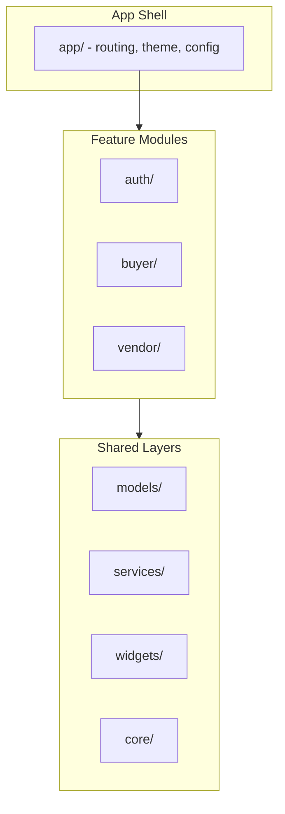

# Flutter Project Structure

**Project:** Artisanal Lane -- Curated Craft Marketplace
**Version:** 1.0

---

## Table of Contents

1. [Architecture Overview](#1-architecture-overview)
2. [Folder Structure](#2-folder-structure)
3. [Feature Module Structure](#3-feature-module-structure)
4. [State Management](#4-state-management)
5. [Routing](#5-routing)
6. [Naming Conventions](#6-naming-conventions)
7. [Code Style](#7-code-style)
8. [Asset Organization](#8-asset-organization)
9. [Key Dependencies](#9-key-dependencies)
10. [Environment Configuration](#10-environment-configuration)

---

## 1. Architecture Overview

The project follows a **feature-first** architecture with a clean separation between presentation, business logic, and data layers.



### Key Principles

- **Feature isolation:** Each feature module is self-contained with its own screens, widgets, and providers.
- **Shared code:** Models, services, and reusable widgets live in shared directories accessible by all features.
- **Dependency injection:** Riverpod provides are used for dependency injection and state management.
- **Repository pattern:** Data access is abstracted behind repository classes that wrap Supabase SDK calls.

---

## 2. Folder Structure

```
artisanal_lane/
├── android/                        # Android platform project
├── ios/                            # iOS platform project
├── web/                            # Flutter Web (admin dashboard)
├── lib/
│   ├── main.dart                   # App entry point
│   ├── main_dev.dart               # Dev environment entry point
│   ├── main_prod.dart              # Production environment entry point
│   │
│   ├── app/                        # App-level configuration
│   │   ├── app.dart                # MaterialApp / root widget
│   │   ├── router.dart             # GoRouter configuration
│   │   ├── theme.dart              # App theme (colours, typography)
│   │   └── env.dart                # Environment config (Supabase keys)
│   │
│   ├── core/                       # Shared utilities & constants
│   │   ├── constants/
│   │   │   ├── app_constants.dart  # App-wide constants
│   │   │   ├── api_constants.dart  # API paths, bucket names
│   │   │   └── ui_constants.dart   # Spacing, sizing, breakpoints
│   │   ├── extensions/
│   │   │   ├── context_ext.dart    # BuildContext extensions
│   │   │   ├── string_ext.dart     # String helper extensions
│   │   │   └── datetime_ext.dart   # DateTime formatting extensions
│   │   ├── utils/
│   │   │   ├── validators.dart     # Form validation helpers
│   │   │   ├── formatters.dart     # Currency, date formatters
│   │   │   └── image_utils.dart    # Image compression, resizing
│   │   └── errors/
│   │       ├── app_exception.dart  # Custom exception classes
│   │       └── error_handler.dart  # Global error handling
│   │
│   ├── models/                     # Data models / entities
│   │   ├── profile.dart
│   │   ├── shop.dart
│   │   ├── product.dart
│   │   ├── category.dart
│   │   ├── cart.dart
│   │   ├── cart_item.dart
│   │   ├── order.dart
│   │   ├── order_item.dart
│   │   ├── escrow_transaction.dart
│   │   ├── dispute.dart
│   │   ├── vendor_application.dart
│   │   └── invite_code.dart
│   │
│   ├── services/                   # External service wrappers
│   │   ├── supabase_service.dart   # Supabase client initialization
│   │   ├── auth_service.dart       # Authentication methods
│   │   ├── storage_service.dart    # File upload/download
│   │   ├── payment_service.dart    # PayFast integration
│   │   └── notification_service.dart # Push notifications
│   │
│   ├── repositories/               # Data access layer
│   │   ├── auth_repository.dart
│   │   ├── profile_repository.dart
│   │   ├── shop_repository.dart
│   │   ├── product_repository.dart
│   │   ├── category_repository.dart
│   │   ├── cart_repository.dart
│   │   ├── order_repository.dart
│   │   ├── favourite_repository.dart
│   │   ├── vendor_application_repository.dart
│   │   └── dispute_repository.dart
│   │
│   ├── features/                   # Feature modules
│   │   ├── auth/
│   │   │   ├── screens/
│   │   │   │   ├── login_screen.dart
│   │   │   │   ├── signup_screen.dart
│   │   │   │   ├── forgot_password_screen.dart
│   │   │   │   └── verify_email_screen.dart
│   │   │   ├── providers/
│   │   │   │   └── auth_provider.dart
│   │   │   └── widgets/
│   │   │       ├── social_login_button.dart
│   │   │       └── auth_form_field.dart
│   │   │
│   │   ├── buyer/
│   │   │   ├── screens/
│   │   │   │   ├── home_screen.dart
│   │   │   │   ├── items_screen.dart
│   │   │   │   ├── shops_screen.dart
│   │   │   │   ├── shop_detail_screen.dart
│   │   │   │   ├── product_detail_screen.dart
│   │   │   │   ├── search_screen.dart
│   │   │   │   ├── favourites_screen.dart
│   │   │   │   ├── cart_screen.dart
│   │   │   │   ├── checkout_screen.dart
│   │   │   │   ├── order_confirmation_screen.dart
│   │   │   │   ├── order_history_screen.dart
│   │   │   │   ├── order_detail_screen.dart
│   │   │   │   └── profile_screen.dart
│   │   │   ├── providers/
│   │   │   │   ├── home_provider.dart
│   │   │   │   ├── product_provider.dart
│   │   │   │   ├── shop_provider.dart
│   │   │   │   ├── cart_provider.dart
│   │   │   │   ├── order_provider.dart
│   │   │   │   ├── favourite_provider.dart
│   │   │   │   └── search_provider.dart
│   │   │   └── widgets/
│   │   │       ├── product_card.dart
│   │   │       ├── shop_card.dart
│   │   │       ├── category_chip.dart
│   │   │       ├── cart_item_tile.dart
│   │   │       ├── order_status_badge.dart
│   │   │       └── shipping_option_tile.dart
│   │   │
│   │   └── vendor/
│   │       ├── screens/
│   │       │   ├── vendor_application_screen.dart
│   │       │   ├── application_status_screen.dart
│   │       │   ├── vendor_dashboard_screen.dart
│   │       │   ├── shop_setup_screen.dart
│   │       │   ├── product_list_screen.dart
│   │       │   ├── product_form_screen.dart
│   │       │   ├── vendor_orders_screen.dart
│   │       │   ├── vendor_order_detail_screen.dart
│   │       │   └── earnings_screen.dart
│   │       ├── providers/
│   │       │   ├── vendor_application_provider.dart
│   │       │   ├── shop_provider.dart
│   │       │   ├── vendor_product_provider.dart
│   │       │   ├── vendor_order_provider.dart
│   │       │   └── earnings_provider.dart
│   │       └── widgets/
│   │           ├── image_upload_grid.dart
│   │           ├── stock_indicator.dart
│   │           ├── earnings_chart.dart
│   │           └── order_action_button.dart
│   │
│   └── widgets/                    # Shared / reusable widgets
│       ├── app_bar.dart
│       ├── bottom_nav_bar.dart
│       ├── loading_indicator.dart
│       ├── error_widget.dart
│       ├── empty_state.dart
│       ├── cached_image.dart
│       ├── price_tag.dart
│       ├── badge.dart
│       └── confirmation_dialog.dart
│
├── assets/                         # Static assets
│   ├── images/
│   │   ├── logo.png
│   │   ├── logo_dark.png
│   │   ├── onboarding_1.png
│   │   ├── onboarding_2.png
│   │   ├── onboarding_3.png
│   │   └── placeholder_product.png
│   ├── icons/
│   │   ├── category_leather.svg
│   │   ├── category_ceramics.svg
│   │   └── ...
│   └── fonts/
│       ├── Poppins-Regular.ttf
│       ├── Poppins-Medium.ttf
│       ├── Poppins-SemiBold.ttf
│       └── Poppins-Bold.ttf
│
├── test/                           # Unit and widget tests
│   ├── models/
│   ├── repositories/
│   ├── providers/
│   └── widgets/
│
├── integration_test/               # Integration tests
│   └── app_test.dart
│
├── pubspec.yaml                    # Dependencies and asset declarations
├── analysis_options.yaml           # Linter rules
├── .env.dev                        # Development environment variables
├── .env.prod                       # Production environment variables
└── .gitignore
```

---

## 3. Feature Module Structure

Each feature follows a consistent internal structure:

```
feature_name/
├── screens/          # Full-page screen widgets
├── providers/        # Riverpod providers and state notifiers
└── widgets/          # Feature-specific widgets (not shared)
```

### Screen Responsibilities

- Accept route parameters (IDs, etc.)
- Watch Riverpod providers for state
- Compose layout from widgets
- Trigger navigation

### Provider Responsibilities

- Hold and manage state
- Call repository methods
- Handle loading/error states
- Expose computed values

### Widget Responsibilities

- Render UI from provided data
- Emit user interactions via callbacks
- Remain stateless where possible

---

## 4. State Management

### Riverpod

Riverpod is the chosen state management solution for its:
- Compile-time safety and testability
- Built-in dependency injection
- Caching and auto-disposal
- Support for async state (AsyncValue)

### Provider Types Used

| Provider Type          | Use Case                                     |
| ---------------------- | -------------------------------------------- |
| `Provider`             | Static dependencies (services, repositories) |
| `FutureProvider`       | One-time async data (categories, shop detail) |
| `StreamProvider`       | Real-time data (order status updates)        |
| `StateNotifierProvider`| Complex state with mutations (cart, forms)   |
| `AsyncNotifierProvider`| Async state with methods (product CRUD)      |

### Example Provider Structure

```dart
// repositories are provided as simple Providers
final productRepositoryProvider = Provider<ProductRepository>((ref) {
  final supabase = ref.watch(supabaseServiceProvider);
  return ProductRepository(supabase);
});

// Async data fetching with auto-caching
final productsProvider = FutureProvider.family<List<Product>, String?>((ref, categoryId) async {
  final repo = ref.watch(productRepositoryProvider);
  return repo.getProducts(categoryId: categoryId);
});

// Complex mutable state
final cartProvider = StateNotifierProvider<CartNotifier, AsyncValue<Cart>>((ref) {
  final repo = ref.watch(cartRepositoryProvider);
  return CartNotifier(repo);
});
```

---

## 5. Routing

### GoRouter Configuration

GoRouter provides declarative, URL-based routing with built-in support for:
- Deep linking
- Route guards (redirect logic)
- Nested navigation (bottom nav tabs)

### Route Structure

```dart
final routerProvider = Provider<GoRouter>((ref) {
  final authState = ref.watch(authProvider);

  return GoRouter(
    initialLocation: '/',
    redirect: (context, state) {
      final isAuthenticated = authState.isAuthenticated;
      final isAuthRoute = state.matchedLocation.startsWith('/auth');

      if (!isAuthenticated && !isAuthRoute) return '/auth/login';
      if (isAuthenticated && isAuthRoute) return '/';
      return null;
    },
    routes: [
      // Auth routes
      GoRoute(path: '/auth/login', builder: (_, __) => const LoginScreen()),
      GoRoute(path: '/auth/signup', builder: (_, __) => const SignupScreen()),

      // Main shell with bottom navigation
      ShellRoute(
        builder: (_, __, child) => MainShell(child: child),
        routes: [
          GoRoute(path: '/', builder: (_, __) => const HomeScreen()),
          GoRoute(path: '/items', builder: (_, __) => const ItemsScreen()),
          GoRoute(path: '/shops', builder: (_, __) => const ShopsScreen()),
          GoRoute(path: '/favourites', builder: (_, __) => const FavouritesScreen()),
          GoRoute(path: '/profile', builder: (_, __) => const ProfileScreen()),
        ],
      ),

      // Detail routes
      GoRoute(path: '/product/:id', builder: (_, state) => ProductDetailScreen(id: state.pathParameters['id']!)),
      GoRoute(path: '/shop/:slug', builder: (_, state) => ShopDetailScreen(slug: state.pathParameters['slug']!)),
      GoRoute(path: '/cart', builder: (_, __) => const CartScreen()),
      GoRoute(path: '/checkout', builder: (_, __) => const CheckoutScreen()),
      GoRoute(path: '/orders', builder: (_, __) => const OrderHistoryScreen()),
      GoRoute(path: '/orders/:id', builder: (_, state) => OrderDetailScreen(id: state.pathParameters['id']!)),

      // Vendor routes
      GoRoute(path: '/vendor/apply', builder: (_, __) => const VendorApplicationScreen()),
      GoRoute(path: '/vendor/dashboard', builder: (_, __) => const VendorDashboardScreen()),
      GoRoute(path: '/vendor/shop/setup', builder: (_, __) => const ShopSetupScreen()),
      GoRoute(path: '/vendor/products', builder: (_, __) => const ProductListScreen()),
      GoRoute(path: '/vendor/products/new', builder: (_, __) => const ProductFormScreen()),
      GoRoute(path: '/vendor/products/:id/edit', builder: (_, state) => ProductFormScreen(id: state.pathParameters['id'])),
      GoRoute(path: '/vendor/orders', builder: (_, __) => const VendorOrdersScreen()),
      GoRoute(path: '/vendor/earnings', builder: (_, __) => const EarningsScreen()),
    ],
  );
});
```

---

## 6. Naming Conventions

### Files

| Type            | Convention                 | Example                        |
| --------------- | -------------------------- | ------------------------------ |
| Screens         | `*_screen.dart`            | `home_screen.dart`             |
| Widgets         | `*_widget.dart` or descriptive | `product_card.dart`        |
| Providers       | `*_provider.dart`          | `cart_provider.dart`           |
| Models          | `<entity>.dart`            | `product.dart`                 |
| Repositories    | `*_repository.dart`        | `product_repository.dart`      |
| Services        | `*_service.dart`           | `auth_service.dart`            |
| Extensions      | `*_ext.dart`               | `string_ext.dart`              |
| Constants       | `*_constants.dart`         | `app_constants.dart`           |

### Dart Code

| Element          | Convention         | Example                        |
| ---------------- | ------------------ | ------------------------------ |
| Classes          | PascalCase         | `ProductCard`                  |
| Variables        | camelCase          | `productList`                  |
| Constants        | camelCase          | `defaultPadding`               |
| Enums            | PascalCase         | `OrderStatus.shipped`          |
| Private members  | `_` prefix         | `_isLoading`                   |
| Providers        | camelCase + Provider suffix | `cartProvider`          |

---

## 7. Code Style

### analysis_options.yaml

```yaml
include: package:flutter_lints/flutter.yaml

linter:
  rules:
    - prefer_const_constructors
    - prefer_const_declarations
    - prefer_final_local_variables
    - avoid_print
    - require_trailing_commas
    - sort_constructors_first
    - prefer_single_quotes
    - always_declare_return_types
```

### General Rules

- Maximum line length: 80 characters.
- Use `const` constructors wherever possible.
- Trailing commas on all multi-argument calls (for cleaner diffs).
- Use `final` for variables that are not reassigned.
- All public API members must have documentation comments.
- Use `freezed` or `json_serializable` for model classes.

---

## 8. Asset Organization

### pubspec.yaml Assets Section

```yaml
flutter:
  assets:
    - assets/images/
    - assets/icons/

  fonts:
    - family: Poppins
      fonts:
        - asset: assets/fonts/Poppins-Regular.ttf
          weight: 400
        - asset: assets/fonts/Poppins-Medium.ttf
          weight: 500
        - asset: assets/fonts/Poppins-SemiBold.ttf
          weight: 600
        - asset: assets/fonts/Poppins-Bold.ttf
          weight: 700
```

### Icon Guidelines

- SVG format for category icons (rendered via `flutter_svg`).
- PNG for raster images (logo, onboarding illustrations).
- All icons should be single-colour for theme adaptability.

---

## 9. Key Dependencies

| Package                  | Version  | Purpose                                    |
| ------------------------ | -------- | ------------------------------------------ |
| `flutter_riverpod`       | ^2.x     | State management and DI                    |
| `go_router`              | ^14.x    | Declarative routing                        |
| `supabase_flutter`       | ^2.x     | Supabase SDK (auth, database, storage)     |
| `cached_network_image`   | ^3.x     | Image loading and disk caching             |
| `flutter_svg`            | ^2.x     | SVG rendering                              |
| `image_picker`           | ^1.x     | Camera and gallery image selection          |
| `image_cropper`          | ^5.x     | Image cropping before upload               |
| `flutter_image_compress` | ^2.x     | Image compression before upload            |
| `url_launcher`           | ^6.x     | Opening PayFast payment URL                |
| `json_annotation`        | ^4.x     | JSON serialization annotations             |
| `json_serializable`      | ^6.x     | Code generation for JSON models            |
| `freezed_annotation`     | ^2.x     | Immutable model annotations                |
| `freezed`                | ^2.x     | Code generation for immutable models       |
| `build_runner`           | ^2.x     | Code generation runner                     |
| `intl`                   | ^0.19.x  | Date and currency formatting               |
| `flutter_dotenv`         | ^5.x     | Environment variable loading               |
| `shimmer`                | ^3.x     | Loading placeholder animations             |

---

## 10. Environment Configuration

### .env Files

```
# .env.dev
SUPABASE_URL=https://<dev-project>.supabase.co
SUPABASE_ANON_KEY=eyJ...
PAYFAST_SANDBOX=true

# .env.prod
SUPABASE_URL=https://<prod-project>.supabase.co
SUPABASE_ANON_KEY=eyJ...
PAYFAST_SANDBOX=false
```

### Entry Points

```dart
// main_dev.dart
void main() async {
  await dotenv.load(fileName: '.env.dev');
  runApp(const ProviderScope(child: ArtisanalLaneApp()));
}

// main_prod.dart
void main() async {
  await dotenv.load(fileName: '.env.prod');
  runApp(const ProviderScope(child: ArtisanalLaneApp()));
}
```

### .gitignore Additions

```
# Environment files
.env.dev
.env.prod
.env

# Generated files
*.g.dart
*.freezed.dart
```
